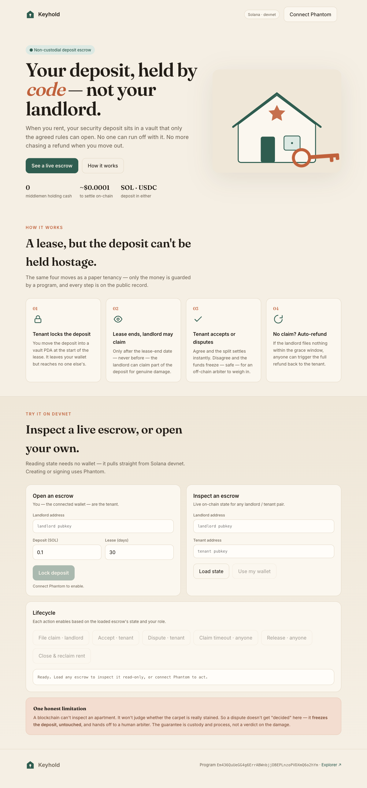

# Deposit Escrow — trustless rental security deposits on Solana

A non-custodial escrow for rental security deposits, written as an on-chain Rust
(Anchor) program. The tenant's deposit is locked in a program-controlled vault —
**neither the landlord nor the tenant can move it unilaterally.** Funds are
released only by rules enforced on-chain.

> Built for the *"Build Everyday Real-World Systems as On-Chain Rust Programs"* challenge.

- **Program ID (devnet):** [`Em436QuUeGG4g6ErrABWnbjjDBEPLnzoPVDXmQ6o2hYm`](https://explorer.solana.com/address/Em436QuUeGG4g6ErrABWnbjjDBEPLnzoPVDXmQ6o2hYm?cluster=devnet)
- **Status:** deployed to devnet, full lifecycle verified with real transactions (links below)

---

## The problem

A rental security deposit is one of the most common escrow arrangements on earth,
and it is broken almost everywhere:

- **The landlord holds the cash.** The tenant has no guarantee it comes back, and
  no visibility into where it sits.
- **Disputes are word-against-word.** "You broke it" vs "it was already like that",
  with no neutral record.
- **Recovery is expensive.** Getting an unfairly withheld deposit back means
  small-claims court — for a sum often smaller than the cost of pursuing it.
- **The reverse is just as bad.** A tenant can vanish, leaving real damage and a
  landlord with no quick recourse.

The core issue: **one party physically controls money that belongs to the situation,
not to them.**

## The Solana solution

Put the deposit somewhere *neither party controls* — a Program Derived Address —
and let code, not a person, enforce the agreed rules.

- The deposit lives in a **vault PDA**. There is no private key for it; only the
  program can move its lamports, and only along the paths below.
- Every transition is **time-boxed on-chain**, which kills the obvious attacks:
  a landlord can't grab the deposit mid-lease, and funds can't be frozen forever
  by one side simply refusing to act.
- Every action is a **public, auditable transaction**.

Solana specifically: deposits are small and time-sensitive, so sub-cent fees and
sub-second finality matter — a deposit escrow that cost \$20 in gas and took a day
to settle would defeat its own purpose.

---

## Architecture

### State machine

```
                 initialize
                     │
                     ▼
                 ┌────────┐   release  (>= lease_end + 3d, no claim filed)   ┌──────────┐
                 │ Active │ ─────────────────────────────────────────────────▶│ Released │
                 └────────┘                                                    └──────────┘
                     │ file_claim (only AFTER lease_end)
                     ▼
                ┌───────────┐  accept_claim  ──────────────▶ ┌─────────┐
                │ ClaimFiled│  claim_timeout (> deadline) ───▶│ Settled │
                └───────────┘                                 └─────────┘
                     │ dispute_claim (within 5-day window)
                     ▼
                ┌──────────┐
                │ Disputed │   funds frozen — off-chain arbitration (see Limitations)
                └──────────┘
```

### Two PDAs (and why)

| PDA | Seeds | Holds | Purpose |
|---|---|---|---|
| `escrow` (data) | `["escrow", landlord, tenant]` | agreement state | who / how much / deadlines / status |
| `vault` | `["vault", escrow]` | deposit lamports only | the actual money, kept separate |

The deposit is held in a **separate vault PDA**, not in the data account. This keeps
the deposit lamports from ever mixing with the data account's rent-exempt reserve —
so a payout can never accidentally drain the rent and corrupt the account
mid-agreement. Funds leave the vault only via `invoke_signed` transfers the program
authorizes.

### Time locks

| Lock | Value | Prevents |
|---|---|---|
| `lease_end` (set at init) | tenant-chosen | landlord claiming **before the lease is even over** |
| Claim response window | 5 days | landlord locking the tenant's money forever by filing a claim |
| Release grace period | 3 days after `lease_end` | tenant yanking the deposit the instant the lease ends, before the landlord can inspect |

---

## Instructions

| Instruction | Caller | Pre-conditions | Effect |
|---|---|---|---|
| `initialize(amount, lease_end)` | tenant | `lease_end` in the future | locks `amount` in the vault, state → `Active` |
| `file_claim(claim_amount)` | landlord | now ≥ `lease_end`, state `Active`, `claim_amount ≤ deposit` | state → `ClaimFiled`, opens 5-day window |
| `accept_claim()` | tenant | state `ClaimFiled` | pays landlord the claim, refunds rest to tenant, → `Settled` |
| `dispute_claim()` | tenant | state `ClaimFiled`, within window | state → `Disputed`, vault frozen |
| `claim_timeout()` | anyone | state `ClaimFiled`, window elapsed | settles in landlord's favor, → `Settled` |
| `release()` | anyone | state `Active`, now ≥ `lease_end + 3d` | full refund to tenant, → `Released` |
| `close_escrow()` | anyone | state `Settled` or `Released` | closes the data account, returns its rent to the tenant |

`claim_timeout`, `release`, and `close_escrow` are **permissionless** — anyone can
crank them once the state allows, so funds never get stuck because the party who
benefits forgot to act, and rent is reclaimed instead of leaking forever.

Every instruction emits an Anchor **event** (`EscrowInitialized`, `ClaimFiled`,
`ClaimResolved`, `ClaimDisputed`, `DepositReleased`, `EscrowClosed`) so an indexer or
frontend can follow each escrow's lifecycle without polling account state.

### Stablecoin (USDC) variant

A rental deposit is a **fiat** amount — "one month's rent". Locking it in volatile
SOL means the deposit's real value drifts during the lease: lock 0.2 SOL, SOL drops
30%, and the tenant is now under-deposited through no one's fault. So the program
ships a **parallel SPL-token instruction set** (`initialize_token`, `file_claim_token`,
`accept_claim_token`, `dispute_claim_token`, `claim_timeout_token`, `release_token`,
`close_token`) that runs the exact same state machine over a **USDC** (or any SPL)
deposit instead of native SOL.

- The token deposit lives in a **vault token account** (a PDA, seeds `["tvault", escrow]`)
  whose authority is the escrow PDA — same non-custodial guarantee, now for tokens.
- The token escrow's data PDA keys on the mint too (`["tescrow", landlord, tenant, mint]`),
  so the same pair can run independent escrows in different currencies.
- The SOL and token paths are **fully isolated** — separate account types
  (`DepositEscrow` vs `TokenEscrow`) and instructions — so neither can corrupt the other.

This is the headline practicality win: a deposit denominated in the same unit as the
rent, settled on rails that cost a fraction of a cent.

---

## Honest limitations

This is the part most "trustless rental" demos skip. The chain **cannot inspect a
physical apartment.** It does not know whether the carpet is actually stained.

So this program does **not** pretend to adjudicate damage. What it does:

- Removes custody risk entirely — no one can run off with the deposit.
- Enforces *timing and process* fairness — no early claims, no indefinite freezes,
  no unilateral withdrawals.
- When the tenant genuinely disagrees, `dispute_claim` moves the escrow to a
  terminal **`Disputed`** state and **freezes the vault**. On-chain, that's the
  honest endpoint: the money is safe and untouched, and resolution moves to an
  off-chain arbiter (a clause in the lease, a mediator, or a court). The program
  guarantees the funds are exactly where everyone left them while that plays out.

A future version could add a designated arbiter key or an escrow-DAO vote to resolve
`Disputed` on-chain — deliberately out of scope here, because a half-built "trustless
judge" is worse than an honest hand-off.

---

## Live on devnet

The full lifecycle — deposit, claim, settlement, and rent reclamation — run
end-to-end with real SOL on devnet:

| Step | What happened | Transaction |
|---|---|---|
| `initialize` | tenant locks 0.15 SOL | [`5dmW2Z…CuurZb`](https://explorer.solana.com/tx/5dmW2Zp9mqJtr5jhUWBkbxsiwfjJdaKsyBNbPAvWGyTtk3mir3m1xygWBP7A2nJj6Cq6Ui99pkRKuDqUJMCuurZb?cluster=devnet) |
| `file_claim` | landlord claims 0.05 SOL for damage | [`4cbd1v…jwPxMu`](https://explorer.solana.com/tx/4cbd1vHyUQq11nhCqtrfYMaqUXRbFUVQfan8dZPUj4xULmdw2VN4erYmw62UPzZxG5z4iBrXECPSxTxjihjwPxMu?cluster=devnet) |
| `accept_claim` | tenant accepts → 0.05 to landlord, 0.10 back to tenant | [`2YMkC1…sLAeQek`](https://explorer.solana.com/tx/2YMkC1nZYqrvixvs6e8AQJbdHFWwrdR7FkQXBmkPTyLjk2xDXMiTrXJZHx9AwAMa1P8REMD3KxwTSLBLxsLAeQek?cluster=devnet) |
| `close_escrow` | data account closed, rent returned to tenant | [`2qrKXM…ZHafCLj`](https://explorer.solana.com/tx/2qrKXMixJjEpV8DjL6tvshNd2CbUiYXc363wSMH5AUMafWCigQJrpZm9Dv4QvkMXaX6NA6uBvtWvTipzVZHafCLj?cluster=devnet) |

And the **USDC variant**, run end-to-end with a real SPL mint on devnet:

| Step | What happened | Transaction |
|---|---|---|
| `initialize_token` | tenant locks 50 USDC | [`5aPnzF…f98bN`](https://explorer.solana.com/tx/5aPnzFPSmaHfuzbdMYEfyqSqPLSSLMDCSrrARmzKAD26FJSDVW8aSSpqaako5mhFNZhhxDGVq7QehbhjjTWf98bN?cluster=devnet) |
| `file_claim_token` | landlord claims 20 USDC | [`4oB39F…aNGx6`](https://explorer.solana.com/tx/4oB39F8ZKoXkqmnm4tARQbAs74H5NsyDWm52JxZnT3ezQPmHaFkskjDa2hU1B4StZYLSFnKSqcr1RGEvXVNaNGx6?cluster=devnet) |
| `accept_claim_token` | 20 → landlord, 30 → tenant | [`tUwP2F…Kb6XH`](https://explorer.solana.com/tx/tUwP2FgVX5Z3A939VQ1XfWSEkC2RDJNyw1heVFwGDi1AqoDQX3XEuMKvNCexcJreCsAXDVa9VzrP8MSgyVKb6XH?cluster=devnet) |
| `close_token` | vault + data account closed, rent reclaimed | [`5dLeFt…KmPM7`](https://explorer.solana.com/tx/5dLeFtMZ8E7poUBdyaQYmYQRTzwi4jrhP8M3dGbZCYinrAbh3pV26UfARG5EtsGKxTxpBThuGDabEazmiknKmPM7?cluster=devnet) |

Program (upgradeable) on devnet:
[`Em436QuUeGG4g6ErrABWnbjjDBEPLnzoPVDXmQ6o2hYm`](https://explorer.solana.com/address/Em436QuUeGG4g6ErrABWnbjjDBEPLnzoPVDXmQ6o2hYm?cluster=devnet)

---

## Tests

All instructions, their edge cases, and adversarial paths are covered by an
[`anchor-bankrun`](https://github.com/kevinheavey/anchor-bankrun) suite — **20 tests**
across two files (`tests/deposit-escrow.ts` for the SOL flow, `tests/token-escrow.ts`
for the USDC flow with a real SPL mint). Bankrun runs against the real SBF program
in-process and lets us **warp the validator clock**, which is the only practical way
to test the lease-end gate, the 5-day claim window, and the 3-day release grace.

```
deposit-escrow
  ✔ initialize: locks the deposit in the vault PDA
  ✔ file_claim: rejected before lease end
  ✔ file_claim: succeeds after lease end and sets ClaimFiled
  ✔ file_claim: rejected when claim exceeds deposit
  ✔ accept_claim: splits deposit between landlord and tenant, empties vault
  ✔ dispute_claim: tenant freezes funds within the window
  ✔ dispute_claim: rejected after the response deadline
  ✔ claim_timeout: settles to landlord after the deadline
  ✔ claim_timeout: rejected before the deadline
  ✔ release: full refund to tenant after grace period with no claim
  ✔ release: rejected before the grace period ends
  ✔ file_claim: rejected when signed by someone other than the landlord
  ✔ accept_claim: rejected when signed by someone other than the tenant
  ✔ accept_claim: rejected a second time (already settled)
  ✔ close_escrow: rejected while the escrow is still active
  ✔ close_escrow: closes the data account and returns rent after settlement

token-escrow (USDC-like)
  ✔ initialize_token: locks the deposit in the token vault
  ✔ accept_claim_token: splits the token deposit and empties the vault
  ✔ release_token: refunds the full token deposit after the grace period
  ✔ close_token: closes the vault and data account after settlement

  20 passing
```

---

## Run it yourself

Prerequisites: Rust, Solana CLI, Anchor (`anchor-cli` 1.0.2), Node/yarn.

```bash
# build the program + generate the IDL
anchor build

# run the full test suite (no validator needed — bankrun runs in-process)
yarn test
```

Drive the live program on devnet with the CLI (the default Solana wallet acts as the
tenant; a landlord keypair is generated at `cli/landlord.json`):

```bash
yarn cli init 0.2 30        # tenant locks 0.2 SOL, lease ends in 30s
yarn cli fund-landlord 0.05 # give the landlord SOL for fees
yarn cli show               # inspect on-chain escrow state
# after lease_end:
yarn cli file-claim 0.08    # landlord claims 0.08 SOL for damage
yarn cli accept             # tenant accepts → deposit split
yarn cli close              # reclaim the data account's rent for the tenant
# alternatives: yarn cli dispute | yarn cli timeout | yarn cli release
```

Run the **USDC** lifecycle end-to-end on devnet (creates a mint, locks a token
deposit, files + settles a claim, then closes):

```bash
yarn ts-node cli/token-demo.ts
```

### Web app — "Keyhold"

A zero-build single-page product site in [`app/`](app/) — warm proptech design
(editorial serif, paper palette, house-and-key motif) that makes the rental context
obvious at a glance. It connects **Phantom** and drives the full SOL lifecycle, with a
live read-only view of any escrow's on-chain state and a visual stage pipeline.
Inspecting an escrow needs no wallet — it reads straight from devnet; creating or
signing actions uses Phantom.

```bash
cd app && python3 -m http.server 8080   # then open http://localhost:8080
```



## Project layout

```
programs/deposit-escrow/src/lib.rs   the on-chain program (14 instructions: 7 SOL + 7 SPL-token)
tests/deposit-escrow.ts              SOL-flow bankrun suite (16 tests)
tests/token-escrow.ts                USDC-flow bankrun suite (4 tests)
cli/index.ts                         devnet CLI for the SOL lifecycle
cli/token-demo.ts                    devnet USDC lifecycle demo (mint → lock → claim → settle → close)
app/                                 zero-build Phantom web dashboard (live state + lifecycle)
```
